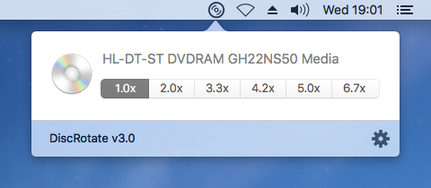

# DiscRotate

A MenuItem utility for macOS that will control the speed of your optical drives. 

Based on my old project at 

## What's new in version 3.0?
- complete rewrite in Swift
- redesigned user interface, app icon, menu icon
- now accurately tests available drive speeds for each media type
- speed data is cached to avoid subsequent tests
- Bluray support

## Requirements

- macOS Yosemite 10.10 or later
- a compatible disc drive

## Installation

1. Download the 
2. Unzip
3. Move the app bundle to /Applications (**Note:** this is important for auto launch on login and the sparkle updater)

## Donation

